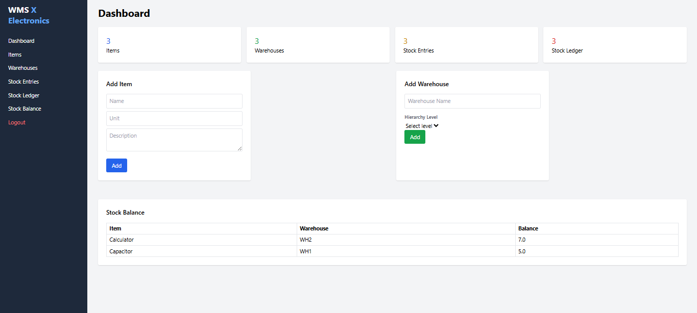
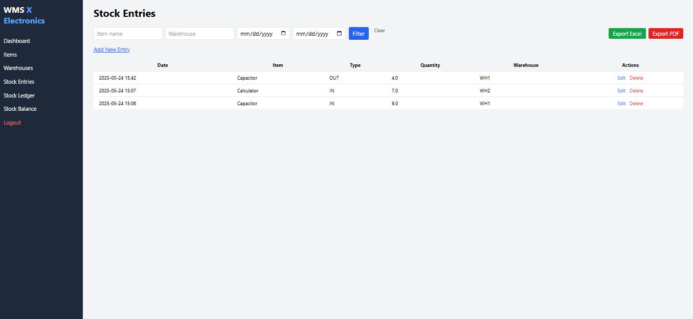
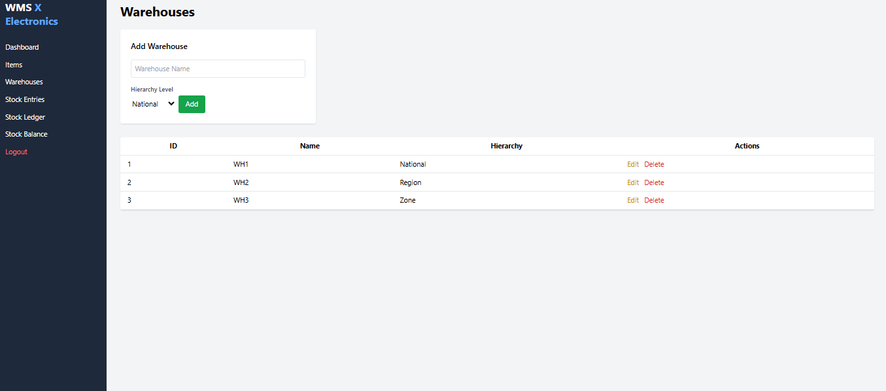

# Warehouse Management System (WMS)
=================================

### Overview
---
This Warehouse Management System is a lightweight inventory tracking solution built with **Flask** and **SQLAlchemy**. It's designed to manage stock entries (IN/OUT), track current stock balances, and visualize the structure of warehouses organized in a hierarchy: National > Regional > Zone > Subzone.

Tech Stack
Backend: Flask (Python)

ORM: SQLAlchemy
Database: SQLite (for development/testing)
Frontend: HTML, Jinja2 templates, Tailwind CSS
Export Formats: PDF (via WeasyPrint), Excel (via openpyxl)
Testing: pytest, Flask-Testing
Version Control: Git + GitHub

---

Design Overview

The system is designed with a clean MVC-style structure and follows modular development principles.
Models: Item, Warehouse, Zone, StockEntry
Zones & Hierarchy:
The warehouse structure includes hierarchy levels like National, Regional, Zone, and Subzone.
Each zone is associated with a warehouse and helps in stock segmentation.
Dashboard: Displays live summaries of Items, Warehouses, Stock Entries, and Ledger.
Templates: Reusable layout with dynamic loading via Flask and Tailwind.

---

Features

Item Management: Add, edit, and track inventory items.
Warehouse Management: Add warehouses and structure them hierarchically.
Zone Management: Group warehouses into zones for better stock control.
Stock Movement: Record IN/OUT stock entries.

Dashboard Summary:
Total number of items, warehouses, stock entries, and stock ledger movements.
Real-time stock balance per item and warehouse.

Export Capabilities:
Download stock movement logs as PDF or Excel.
Custom filters supported before export.

Unit Tests: Key functionality tested using pytest.

Navigation Guide

/ → Dashboard
/items → Add/Edit Items
/warehouses → Add Warehouses
/stock_entries → Add/Review Stock Movement
/stock_ledger → Stock Movement History
/export_stock_entries?format=pdf → Download ledger as PDF
/export_stock_entries?format=excel → Download ledger as Excel

Screenshots

Dashboard  

Stock Entry Form  

Stock Entry  

Stock Ledger with Export Buttons  

Warehouse  

Stock Balance  

Running & Testing Locally

git clone https://github.com/Levinmunyelele/Warehouse-Management-Sytem.git
cd Warehouse-Management-Sytem
python -m venv venv
source venv/bin/activate  # Windows: venv\Scripts\activate
pip install -r requirements.txt
flask run

To run tests:
pytest
